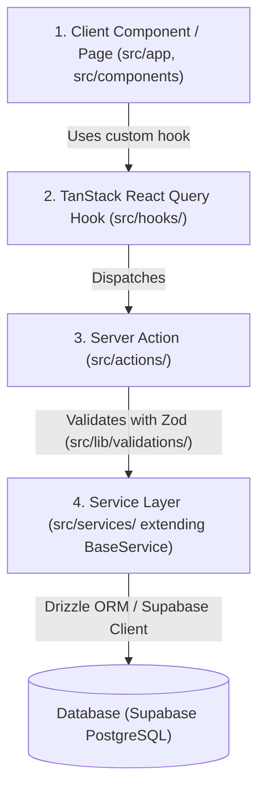

# CESAFI Sports Web — System Architecture & Developer Guide

## 1. Overview & Technology Stack

The **CESAFI Sports Web** application is built on a modern, type-safe, performance-optimized React 19 / Next.js 15 stack designed to manage and display sports leagues, tournaments, rosters, schedules, and live statistics.

### Tech Stack Matrix
| Component | Technology | Description |
| :--- | :--- | :--- |
| **Framework** | Next.js 15 (App Router, Server Components & Actions) | Core web framework |
| **UI Library** | React 19 | View layer |
| **Database** | Supabase (PostgreSQL) | Managed relational database |
| **ORM / Data Access** | Drizzle ORM & `@supabase/supabase-js` | Type-safe SQL client & Auth/RLS |
| **Styling** | Vanilla CSS & Tailwind CSS 4.0 | Design system & component styling |
| **UI Components** | Shadcn UI & Lucide Icons | Accessible, customizable UI primitives |
| **State & Caching** | TanStack React Query v5 | Client-side cache, refetching & optimistic updates |
| **Validation** | Zod v4 | Schema validation across API/Action boundary |
| **Media Storage** | Cloudinary | Image storage, transformation, & dynamic optimization |
| **Rich Text Editor** | Lexical | Rich text editor for news articles |

---

## 2. Architecture & Data Flow

The application enforces a strict **4-layer unidirectional data flow**:



### Layer Breakdown

1. **Client Components Layer (`src/app/`, `src/components/`)**
   - Pure React 19 UI components using Tailwind CSS and Shadcn UI.
   - Consumes hooks for state management and user interactions.
   - Implements full screen responsiveness and dynamic UX states (loading, empty, error).

2. **Custom Hooks Layer (`src/hooks/`)**
   - Encapsulates TanStack React Query (`useQuery`, `useMutation`).
   - Manages automatic cache invalidation using structured Query Keys (e.g., `sportsKeys`, `playersKeys`).
   - Handles optimistic updates and toast notifications (`sonner`).

3. **Server Actions Layer (`src/actions/`)**
   - Next.js Server Actions tagged with `'use server'`.
   - Performs incoming parameter parsing and Zod schema validation (`src/lib/validations/`).
   - Handles revalidation of Next.js static/dynamic pages (`revalidatePath`, `revalidateTag`).

4. **Service Layer (`src/services/`)**
   - Classes extending `BaseService` (`src/services/base.ts`).
   - Contains all direct database queries (Drizzle ORM / Supabase).
   - Standardizes error responses using `ServiceResponse<T>` (`{ success: true, data: T }` or `{ success: false, error: string }`).

---

## 3. Role-Based Access Control (RBAC) & Middleware

Authentication and authorization are managed through **Supabase Auth** combined with Next.js Middleware.

### User Roles
- `admin`: Complete system control across all modules and configuration pages.
- `league_operator`: Manages matches, schedules, scores, categories, and sport statistics.
- `head_writer`: Manages news articles, FAQs, timeline milestones, and media assets.
- `writer`: Drafts and submits news articles.

### Route Protection Configuration (`src/lib/routes.ts`)
Protected routes are defined with strict regex pattern matching in `ROUTE_PATTERNS` and role-mapped arrays in `ROLE_ROUTES`.

```typescript
export const ROLE_DASHBOARDS = {
  admin: '/admin',
  head_writer: '/head-writer',
  league_operator: '/league-operator',
  writer: '/writer'
} as const;
```

---

## 4. Entity Addition Workflow

Whenever adding a new entity or feature to the codebase, follow this strict sequence:

1. **Database Table Creation:** Add the table in Supabase PostgreSQL (via Drizzle schema or SQL script).
2. **Type Definitions:** Export types from `src/db/schema/` or update `database.types.ts`.
3. **Zod Validation Schema:** Create schema definitions in `src/lib/validations/<entity>.ts`.
4. **Service Layer Implementation:** Build a service class in `src/services/<entity>.ts` extending `BaseService`.
5. **Server Actions:** Implement Next.js Server Actions in `src/actions/<entity>.ts` integrating Zod validation and service calls.
6. **React Query Hooks:** Create custom hooks in `src/hooks/use-<entity>.ts`.
7. **UI Components & Pages:** Construct user-facing views in `src/components/` and `src/app/`.
8. **Routing Registration:** Update `PUBLIC_ROUTES` or `PROTECTED_ROUTES` in `src/lib/routes.ts`.

---

## 5. Database Schema & Dynamic Statistics Model

### Core Entities & Relationships
- **`seasons`**: Defines competition academic years (e.g., CESAFI Season 24).
- **`sports`**: Master list of sports (Basketball, Volleyball, Karatedo, Beach Volleyball, Football, Chess, etc.).
- **`sports_categories`**: Sub-divisions per sport (Seniors, Juniors, Men's, Women's).
- **`schools`**: Participating educational institutions.
- **`schools_teams`**: Team instances linking a school to a sport category and season.
- **`players`**: Athlete profiles.
- **`player_seasons`**: Historical roster bindings linking a player to a team for a specific season.
- **`matches` & `games`**: Match fixtures, game sets, scores, and status (`scheduled`, `live`, `completed`, `postponed`).
- **`game_stats`**: Per-game player performance data using flexible columns `stat1` through `stat12`.
- **`sport_stat_mappings`**: Configurable dictionary mapping `stat1...stat12` columns to human-readable labels (e.g., `stat1` = "Points" for Basketball, `stat1` = "Goals" for Football).
